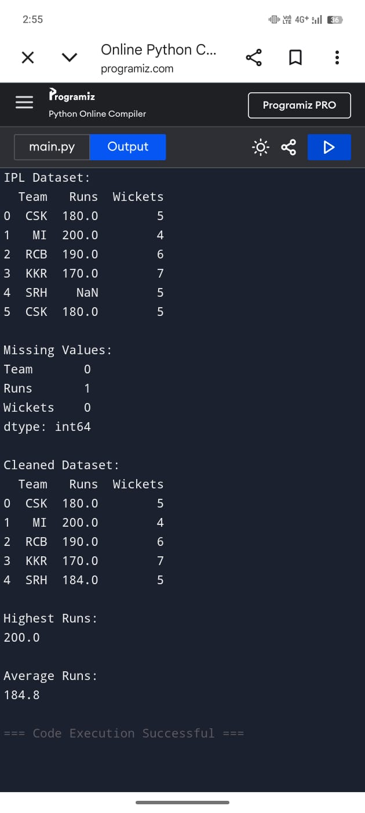

# Data Cleaning and Visualization Project

This repository contains code and resources for cleaning datasets and visualizing their properties using Python. The project demonstrates best practices in data preprocessing and showcases insightful visualizations that help in understanding the underlying patterns and distributions in the data.

## Features

- Data cleaning and preprocessing (handling missing values, duplicates, outliers, etc.)
- Generation of descriptive statistics
- Visualizations including histograms, scatter plots, box plots, and more

## Example Output

Below is an example of an output plot generated by the project:

## Getting Started

1. *Clone this repository:*
   bash
   git clone https://github.com/varun-jagtap/Data-cleaning-and-Visualization-project.git
   cd Data-cleaning-and-Visualization-project
   

2. *Install dependencies:*
   bash
   pip install -r requirements.txt
   

3. *Run the main script:*
   bash
   python main.py
   

The main script will read the data, clean it, and produce visualizations stored in the output/ directory.

## Requirements

- Python 3.7+
- See requirements.txt for all dependencies.
